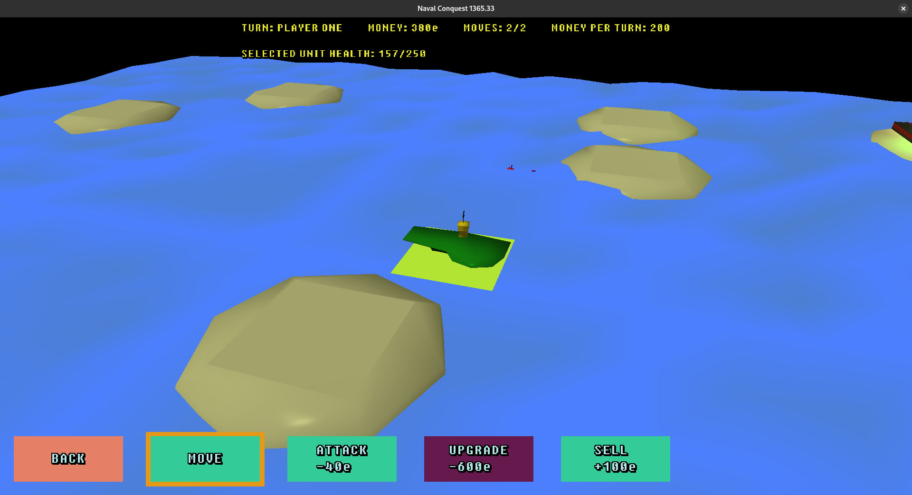
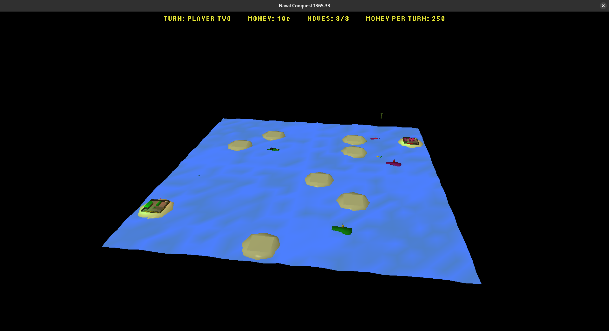

# Naval Conquest

Naval Conquest is a simple two-player local strategy game powered by OpenGL, where the goal is to shoot down the other player's base.




## Compiling

To build the project, you must have **CMake** installed and a compiler that supports **C++20**. On Linux, you need `glfw-devel` (might be called `libglfw-dev`) for compiling and `glfw` (might be called `libglfw3`) for running.

Navigate to the project folder and run the following commands:

```Bash
cd bin
cmake .. -DCMAKE_BUILD_TYPE=Release
make # Or your platform's build tool 
```
If you are going to make changes, it is recommended to run CMake in debug mode and run the Python scripts from the `tools` folder manually or by using `-DUSE_TOOLS=On`.
```Bash
cmake .. -DCMAKE_BUILD_TYPE=Debug -DUSE_TOOLS=On
```

## License

This project is licensed under the MIT License, except for the `lib` folder. See the [LICENSE](LICENSE.txt) file for details.